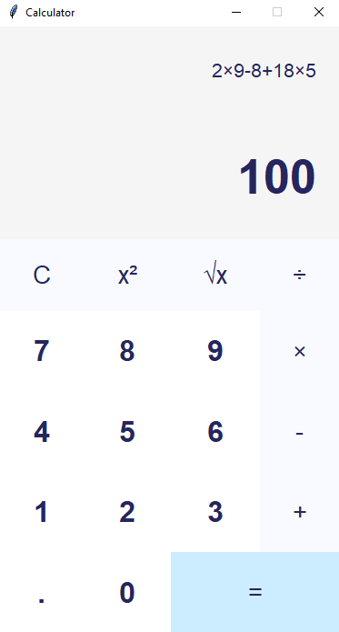
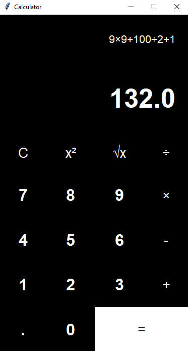

# Calculator
A powerful calculator with multiple themes using python [tkinter](https://docs.python.org/3/library/tkinter.html) GUI package which is the standard Python interface to the Tcl/Tk GUI toolkit.

## Operations:
- Addition 
- Subtraction
- Multiplication
- Division
- Square 
- Square root

## Screenshots

 

## Download
You can download the executable file for Windows [here](https://drive.google.com/file/d/1AX9UF7FtjNMyOPAA3I9fl52cLbhOy1t7/view?usp=sharing)

